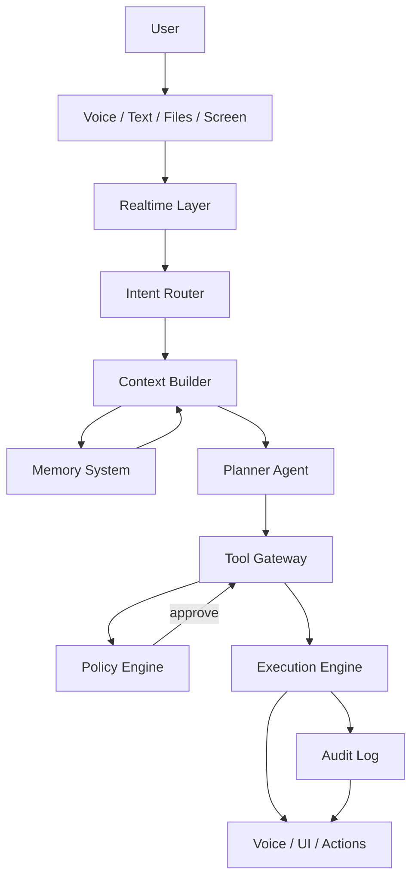

# Architecture Overview

## High-Level Flow

## Monorepo Layout

| Path | Role |
|------|------|
| `apps/web` | Next.js client: chat, voice controls, approvals, workflows, settings |
| `services/api` | FastAPI: REST, WebSocket, auth context, orchestration entrypoints |
| `services/agent` | Intent routing, context, planners, specialized agents (Python package) |
| `services/memory` | Memory CRUD, extraction hooks, embedding/search integration |
| `services/tools` | Tool registry, gateway, execution adapters (mock + future real) |
| `services/audit` | Append-only audit API + storage helpers |
| `services/workflow` | Long-running workflow state, steps, pause/resume |
| `services/notifications` | In-app and future push/email |
| `packages/shared-types` | Shared TypeScript types and API contracts |
| `packages/policy-engine` | Shared policy/risk enums and validation helpers |
| `infra/docker` | Compose snippets, local **`otel-collector`** config (Phase 13) |

## Service Boundaries (Current)

Initial delivery **bundles** HTTP and background hooks inside `services/api` for a single deployable binary, while **Python packages** (`friday_agent`, `friday_memory`, etc.) keep boundaries clean for later process split (Kubernetes, sidecars, separate workers).

## Data Stores

- **PostgreSQL + pgvector** — Relational data, embeddings, hybrid search substrate.
- **Redis** — Sessions, rate limits, Celery/Temporal broker (placeholder).
- **Object storage** (future) — Raw document blobs; API uses local disk in dev.

## External Systems (Abstracted)

- LLM providers (OpenAI, Anthropic, Google) via `ProviderRegistry`.
- Realtime voice (OpenAI Realtime or equivalent) via `RealtimeProvider` abstraction.
- Identity: OAuth (Google, Microsoft, GitHub, Slack) behind `AuthProvider` interfaces.

## Observability

- **Structured logging** — JSON logs with `trace_id` / `span_id` (OpenTelemetry context when active), `user_id`, `session_id`.
- **OpenTelemetry** — Optional OTLP HTTP trace export (Phase **13**); enable with **`OTEL_ENABLED=true`** and point **`OTEL_EXPORTER_OTLP_ENDPOINT`** (or **`OTEL_EXPORTER_OTLP_TRACES_ENDPOINT`**) at a collector. Local dev: **`docker compose up otel-collector`**. **`GET /api/v1/meta`** includes a sanitized **`observability`** block; **`GET /api/v1/ready`** remains the live dependency probe (Phase **9**). See **`docs/architecture/opentelemetry.md`**.

## Deployment Shape (Target)

- Container per service + shared Postgres/Redis.
- Stateless API + WebSocket sticky sessions via gateway.
- Workers for Celery/Temporal consuming Redis or cloud queue.
